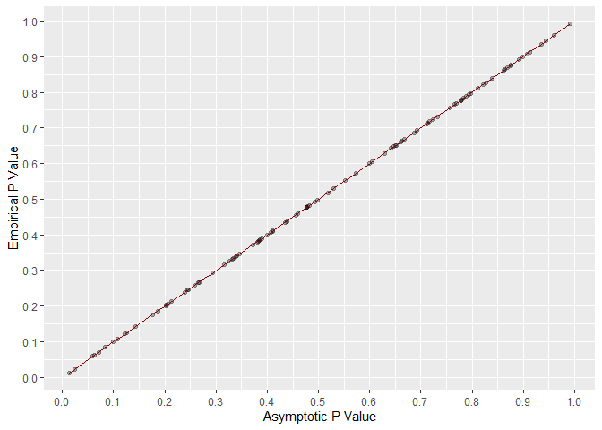
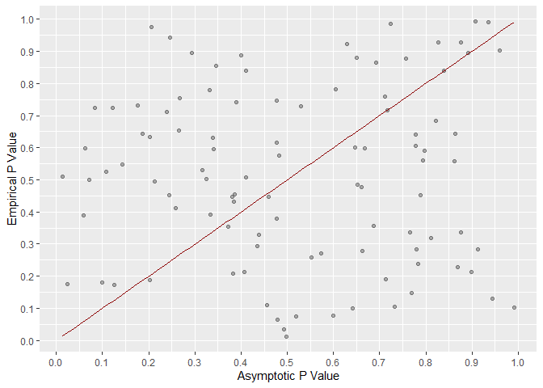
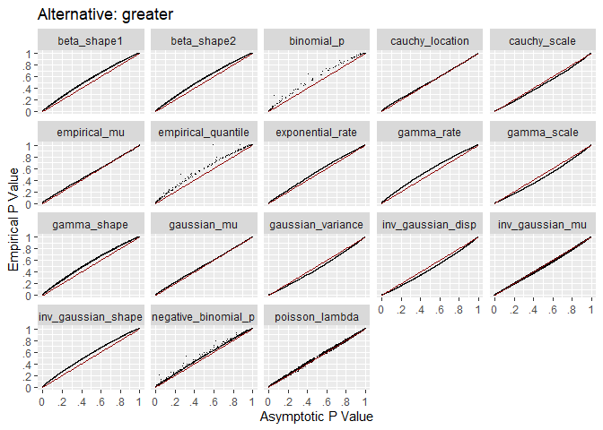
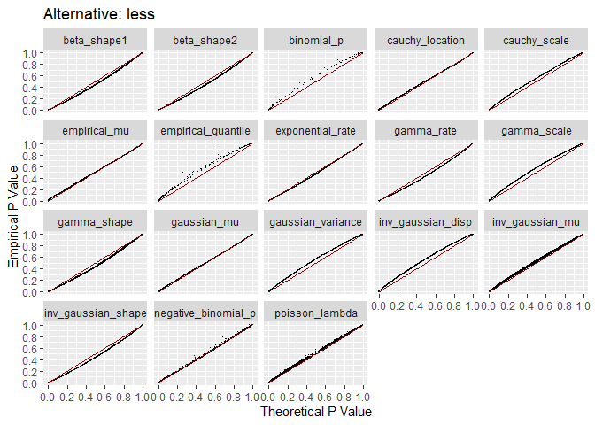
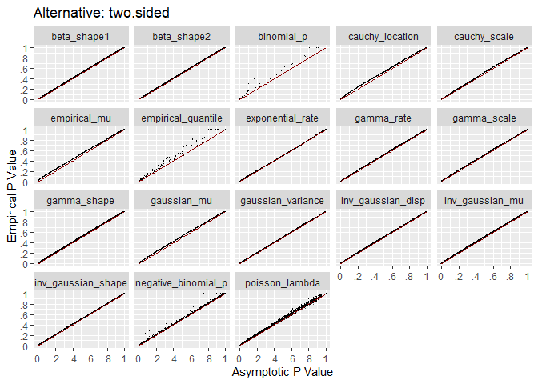
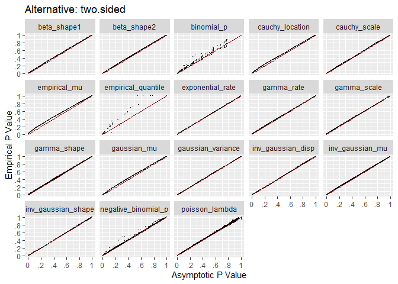

# Repo Overview

For likelihood ratio tests, exact sampling distributions are unknown for
most probability density functions. Instead, p value calculations rely
on the asymptotic $\chi^2$ approximation. This repo explores the
calibration of p values when sample size is small. The goal is to
identify a sample size such that the approximation becomes good enough.

# Calibration Overview

Definitions:

- Asymptotic p value - p value based on the asymptotic $\chi^2$
  approximation.
- Empirical p value - proportion of p values as extreme or more extreme
  than the asymptotic p value.

If the $\chi^2$ approximation is exact, the asymptotic p value will
match the empirical p value exactly. Visually, all dots fall on the red
line.

If the $\chi^2$ approximation is completely inaccurate, there is no
correlation between the two p value calculations.

# Simulation Process

For each test:

- Generate data from distribution.
- Call hypothesis testing function and get asymptotic p value.
- Compare each iteration’s asymptotic p value to all other asymptotic p
  values to calculate an empirical p value.

Sample size is increased and the process is repeated until calibration
is good between the two p values.

# One Sample Calibration

Ideally, calibration is good across the entire range of asymptotic p
value. What is critical is calibration at .20 and less. Almost no one
sets $\alpha$ above .20 when testing.

For all three alternative hypotheses, dots are near the red line for
asymptotic p values below .20. Most tests are well calibrated over the
entire range of asymptotic p values.

# One Way Calibration

For one way tests, calibration is great for most tests. The empirical
quantile test has the worst calibration.

