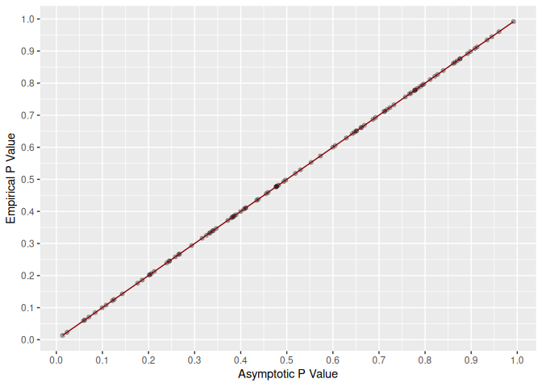
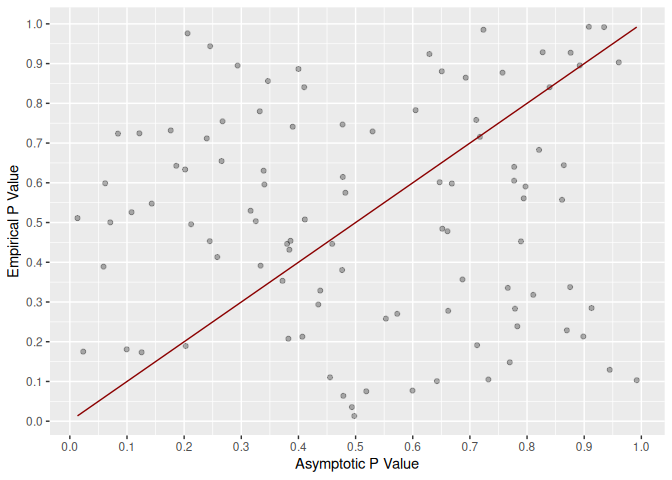
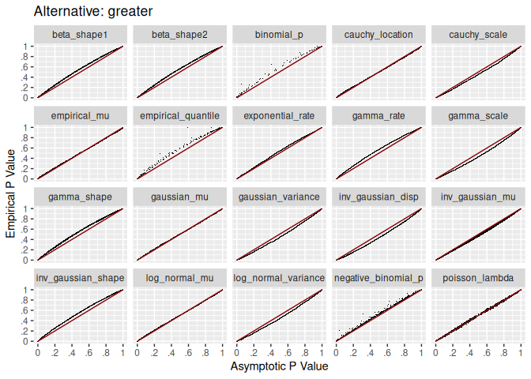
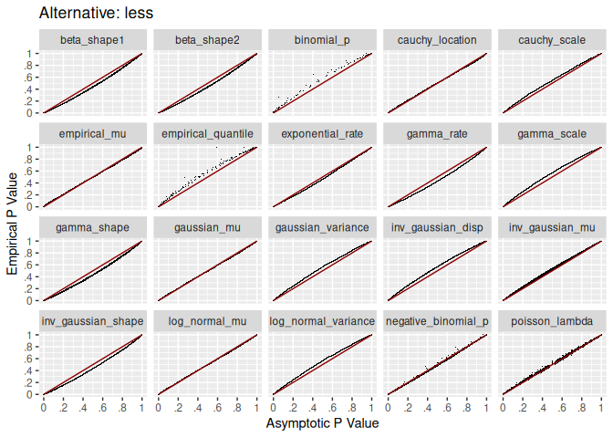
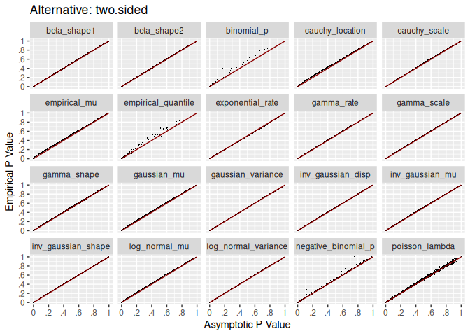

# Repo Overview

For likelihood ratio tests, exact sampling distributions are unknown for
most probability density functions. Instead, p value calculations rely
on the asymptotic $\chi^2$ approximation. This repo explores the
calibration of p values when sample size is small. The goal is to
identify a sample size such that the approximation becomes good enough.

# Calibration Overview

Definitions:

- Theoretical p value - p value based on asymptotic $\chi^2$
  approximation.
- Empirical p value - proportion of p values as extreme or more extreme
  than the theoretical p value.

If the $\chi^2$ approximation is exact, the theoretical p value will
match the empirical p value exactly. Visually, all dots fall on the read
line.

If the $\chi^2$ approximation is completely inaccurate, there is no
correlation between the two p value calculations.

# Simulation Process

For each test:

- Generate data from distribution.
- Call hypothesis testing function and get theoretical p value.
- Compare each iteration’s theoretical p value to all other theoretical
  p values to calculate an empirical p value.

N is increased and the process is repeated until calibration is good
between the two p values.

# One Sample Calibration

Ideally, calibration is good across the entire range of theoretical p
value. What is critical is calibration at .20 and less. Almost no one
sets $\alpha$ above .20 when testing.

For all three alternative hypotheses, dots are near the red line for
theoretical p values below .20. Most tests are well calibrated over the
entire range of theoretical p values.

# One Way Calibration

For one way tests, calibration is great for most tests. The empirical
quantile test has the worst calibration.

